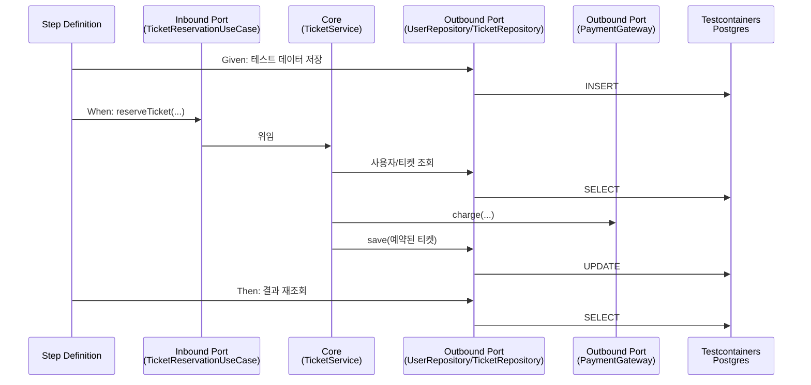

# C-5: Cucumber 인수테스트 + Testcontainers

## 1. 실행 방법 / 실행 결과

```bash
cd TicketService
gradle test
```

- 유닛테스트(`TicketServiceTest` 등)와 Cucumber 인수테스트(`CucumberRunnerTest`)가 같은 `test` 태스크로 함께 실행된다.
- GitHub Actions(`.github/workflows/ticket-service-ci.yml`)가 `master`에 push될 때마다 ubuntu-latest 러너에서 동일한 테스트를 실행한다. 실행 결과는 저장소의 **Actions** 탭에서 확인할 수 있다.

## 2. Unhappy Path를 먼저 떠올린 과정

Happy Path가 성립하려면 반드시 필요했던 조건 3가지(사용자 존재, 티켓 예약 가능, 결제 성공)를 하나씩 깨트려가며 Unhappy Path 상황을 정리했다.

첫째, 사용자가 존재하지 않는 경우다. API를 직접 호출하는 개발자가 잘못된 정보를 보내는 경우도 있고, 탈퇴한 사용자가 화면이 아직 살아있는 상태에서 예약 버튼을 누르는 경우도 있다. 두 경우 모두 예약은 실패해야 한다.

둘째, 티켓이 예약 불가능한 경우다. 예약 가능해 보이는 좌석 하나를 두 명의 사용자가 동시에 예약 버튼을 눌렀을 때, 한 명만 성공하고 나머지 한 명은 실패 처리되어야 하는 상황이 있을 수 있다.

셋째, 결제가 실패하는 경우다. 카드사·은행 서버는 정상적으로 응답한다고 가정했을 때, 카드 한도 초과, 통장 잔액 부족, 유효하지 않은 카드번호 같은 이유로 결제가 거절될 수 있다.

## 3. 포트/어댑터가 인수테스트와 만나는 지점

사전 준비 단계(Given)에서는 Step Definition이 Repository(Outbound Port)를 직접 호출해서, 존재하는 사용자와 가격·번호가 있는 예약 가능한 티켓을 DB에 미리 저장해둔다. 이 시점에는 아직 Core(`TicketService`)가 등장하지 않는다. Unhappy Path를 검증할 때는 같은 방식으로 이미 다른 사용자에게 예약된 티켓 상태를 미리 만들어두기도 한다.

실행 단계(When)에서 비로소 Step Definition이 `TicketReservationUseCase`(Inbound Port)를 호출한다. 이 호출 하나로 예약 시도 전체가 진행되며, 그 안에서 `TicketService`(Core)가 스스로 판단해서 사용자 존재 여부와 티켓 예약 가능 여부를 Outbound Port로 확인하고, 결제 수단(`PaymentGateway`)도 이 과정에서 함께 호출된다.

확인 단계(Then)에서는 Step Definition이 다시 Repository(Outbound Port)를 직접 호출해서, 예약과 결제가 끝난 뒤 DB에 실제로 반영된 결과가 맞는지 확인한다.

이 모든 Repository(Outbound Adapter)는 이번 인수테스트에서 Mock이 아니라, Testcontainers가 띄운 실제 Postgres 컨테이너에 연결되어 있어서, DB와의 진짜 통신까지 검증된다. 반면 결제사(`PaymentGateway`)는 Testcontainers로 띄울 수 있는 실제 인프라가 아닌 외부 SaaS이므로, 시나리오별로 성공/실패를 직접 제어할 수 있는 `ControllablePaymentGateway`라는 테스트 전용 어댑터로 대체했다.


