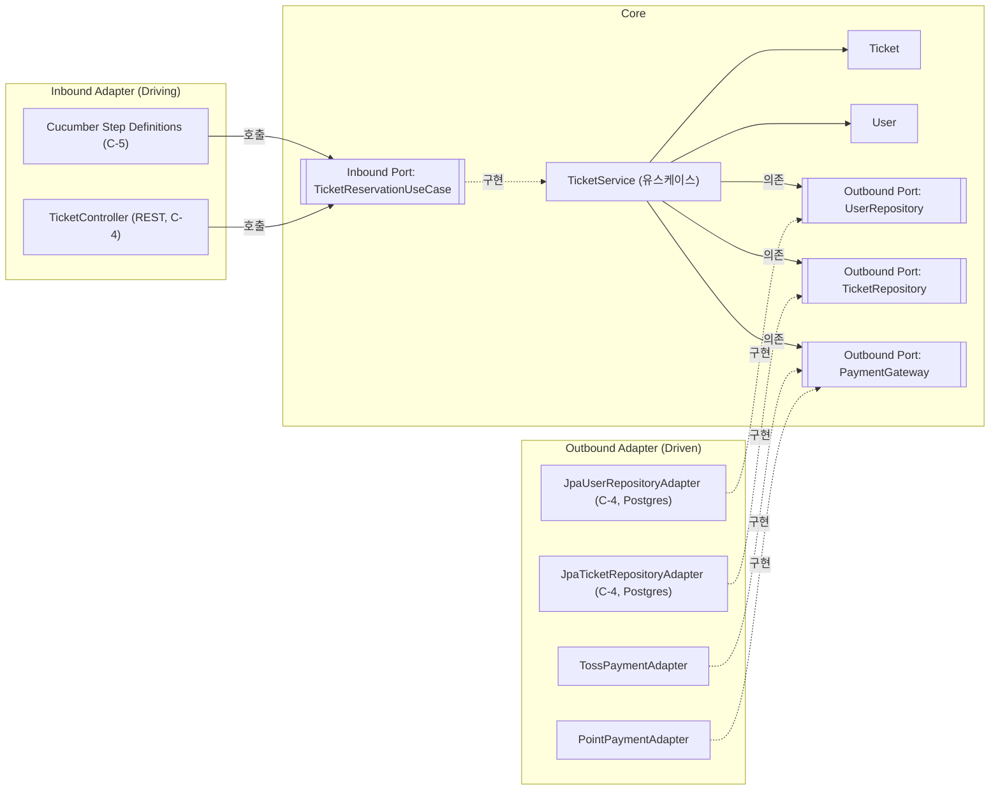

# TicketService 헥사고날(포트와 어댑터) 설계

## 1. Core / Port / Adapter 식별

1-2(SOLID 리팩토링)에서 만든 구조를 그대로 헥사고날의 4개 영역에 배치하면 다음과 같다.

| 영역 | 클래스/인터페이스 | 역할 |
|---|---|---|
| **Core — 도메인** | `Ticket`, `User`, `PaymentInfo` | 상태 + 불변식을 가진 도메인 모델. `Ticket.reserve()`가 "이미 예약된 티켓은 다시 예약 못 한다"는 규칙을 스스로 지킨다. |
| **Core — 애플리케이션(유스케이스)** | `TicketService` | 유스케이스 오케스트레이션(유저 확인 → 티켓 확인 → 결제 → 저장). 인프라를 모르고 포트 인터페이스만 안다. |
| **Inbound Port** | `TicketReservationUseCase` | 바깥(드라이빙 어댑터)이 Core를 호출하는 계약. `TicketService`가 구현한다. *(이번에 새로 추출 — 기존엔 `TicketService`를 어댑터가 구체 클래스로 직접 호출하고 있었다.)* |
| **Outbound Port** | `UserRepository`, `TicketRepository`, `PaymentGateway` | Core가 바깥 세계(DB, 결제사)에 요구하는 계약. Core가 정의하고, 인프라가 구현한다(DIP). |
| **Inbound Adapter** | `TicketController`(REST, C-4에서 구현) / (C-5에서 추가 예정) Cucumber Step Definitions | `TicketReservationUseCase`를 호출해 Core를 구동(driving)한다. |
| **Outbound Adapter** | `TossPaymentAdapter`, `PointPaymentAdapter` (구현됨) / `JpaUserRepositoryAdapter`, `JpaTicketRepositoryAdapter` (C-4에서 구현, Postgres) | Outbound Port를 구현해 실제 DB·PG사와 통신한다(driven). |

## 2. 다이어그램

화살표 방향이 핵심이다: Inbound/Outbound 어댑터 모두 **Core 쪽 인터페이스를 향해** 화살표가 모인다(호출하거나 구현한다). Core는 어떤 어댑터가 붙어 있는지 전혀 모른다 — 이것이 "의존성이 안쪽을 향한다"는 것의 실제 모습이다.

## 3. When ↔ Inbound Port 매핑 (원칙)

핵심 유스케이스는 하나: **"사용자가 티켓을 예약한다(결제 포함)"**. 이 유스케이스에 대해 지켜야 할 매핑 규칙은 다음과 같다.

| Inbound Port 메서드 | 대응하는 Gherkin 요소 |
|---|---|
| `TicketReservationUseCase.reserveTicket(long userId, long ticketId, PaymentInfo info)` | Scenario 안의 `When` 절 **정확히 1개** |

**규칙이 성립하는 이유**: `reserveTicket()` 한 번의 호출로 유저 검증·티켓 검증·결제·저장이 전부 Core 안에서 처리되도록 설계했기 때문에, 바깥(Gherkin 시나리오)에서도 "예약한다"는 행동 하나만 `When`으로 적으면 충분하다. 반대로 `When`이 여러 줄로 쪼개진다면, 그건 Inbound Port가 유스케이스 단위로 안 잘려 있다는 신호다.

**이 규칙을 실제로 적용한 시나리오**는 별도 제출물(2번 항목)인 [`src/test/resources/ticket/reserve_ticket.feature`](../src/test/resources/ticket/reserve_ticket.feature)에 있다. 이 문서(1번 항목)는 매핑 원칙만 다루고, 실제 시나리오 문장은 담지 않는다.

## 4. Why 헥사고날 — 어댑터 교체 무수정 + 테스트 용이성

이 구조를 쓰는 이유는 두 가지 실증된 사실로 설명된다.

**첫째, 어댑터를 교체해도 Core는 한 글자도 안 바뀐다.** `docs/new-requirement-point-payment.md`에서 이미 검증했듯, 카드 결제(`TossPaymentAdapter`)만 있던 상태에서 포인트 결제(`PointPaymentAdapter`)를 추가할 때 `TicketService`, `Ticket`, `PaymentGateway`는 전혀 수정되지 않았다. `TicketService`는 생성자로 `PaymentGateway` 인터페이스만 받고, 그 안에 어떤 구현체가 들어있는지 모른다. 이번에 추가한 `TicketReservationUseCase`(Inbound Port)도 같은 논리다 — 지금은 테스트 코드가 `TicketService`를 직접 생성해 호출하지만, C-5에서 Cucumber Step이나 나중에 REST 컨트롤러가 붙어도 그 어댑터들은 `TicketReservationUseCase` 인터페이스 하나만 알면 된다. 결제사를 Toss에서 실제 PG사(이니시스, KG모빌리언스 등)로 바꾸는 상황을 가정해도 마찬가지다 — 새 `PaymentGateway` 구현체 하나만 추가하고 조립(생성자 주입) 지점만 바꾸면 되고, 예약 규칙·검증 순서·트랜잭션 경계를 담고 있는 `TicketService`는 무수정이다. 이게 가능한 이유는 의존성 방향이 항상 안쪽(Core가 정의한 인터페이스)을 향하기 때문이다 — Core가 "나는 이런 능력이 필요하다"고 인터페이스로 선언하고, 바깥 어댑터가 그 계약에 맞춰 자신을 끼워 넣는 구조(DIP)라서, 바깥이 바뀌어도 안쪽은 그 변화를 알 방법이 없다.

**둘째, Mock으로 Core만 빠르게 단위 테스트할 수 있다.** `TicketServiceTest`가 이미 이 이점을 쓰고 있다 — `UserRepository`, `TicketRepository`, `PaymentGateway`를 전부 Mockito Mock으로 대체해서, 실제 DB나 실제 PG사 API 호출 없이 밀리초 단위로 "유저 없음 → 예외", "이미 예약된 티켓 → 예외", "결제 실패 → 롤백 없이 예외" 같은 Core의 규칙만 검증한다. 만약 `TicketService`가 인터페이스가 아니라 `TossPaymentGatewayImpl` 같은 구체 클래스에 직접 의존했다면, 이 테스트는 실제 결제망을 흉내 내는 스텁 서버를 띄우거나 네트워크 호출을 감수해야 했을 것이다. 포트(인터페이스)가 Core와 바깥 세계 사이의 절단면 역할을 하기 때문에, 그 경계에서 Mock으로 갈아끼우는 것만으로 Core의 로직만 격리해서 빠르고 결정적으로(deterministic) 테스트할 수 있다. 이는 C-5에서 Gherkin 시나리오를 Cucumber로 실행할 때도 동일하게 적용된다 — Step Definition은 실제 어댑터 대신 테스트용 Outbound Port 구현체(인메모리 Repository, 항상 성공하는 PaymentGateway 등)를 주입해 시나리오를 빠르게 반복 실행할 수 있다.
